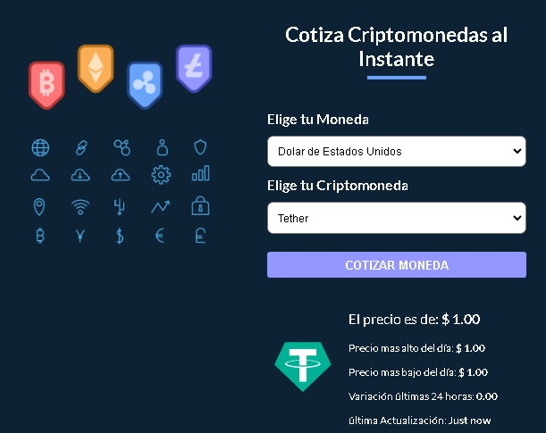

# Udemy - Aprende React: Hooks, State, MERN, Next.js, Remix Run, Redux, Tailwind CSS, Prisma y mucho más - CREANDO +15 APPS REALES

Esta es una solucion al Tercer Proyecto  del curso: [*"Aprende React: Hooks, State, MERN, Next.js, Remix Run, Redux, Tailwind CSS, Prisma y mucho más - CREANDO +15 APPS REALES"*](https://www.udemy.com/course/react-de-principiante-a-experto-creando-mas-de-10-aplicaciones/).

## Table of contents

- [Overview](#overview)
  - [Screenshot](#screenshot)
  - [Links](#links)
- [My process](#my-process)
  - [Built with](#built-with)
  - [What I learned](#what-i-learned)
- [Author](#author)

## Overview

### Screenshot

### Links

- Solution URL: [Solution](https://github.com/samuelpklm/cotizar-cripto)
- Live Site URL: [Live Site](https://sparkly-cheesecake-138b28.netlify.app/)

## My process

### Built with

- Semantic HTML5 markup
- Mobile-first workflow
- [React](https://reactjs.org/) - JS library
- React + TypeScript + Vite

### What I learned

I learned to integrate react with typescript, and to use third-party Hook libraries written in TypeScript.
create custom hooks, and query APIS.

## Author

- Website - [Samuel](https://samuelpklm.github.io/samuel.github.com/)
- Frontend Mentor - [@samuelpklm](https://www.frontendmentor.io/profile/samuelpklm)
- Correo - samuelr76@gmail.com
